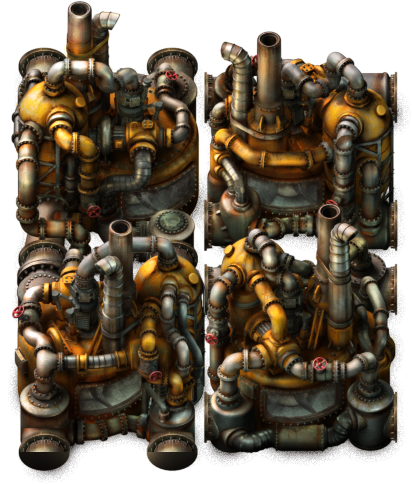

# factorio-bpdraw
Factorio blueprint drawing in go.  
  
## DONE:
- Read entity info from game
- Animated entities
- Static entities
- Shadows
## TODO:
- Cables
- Walls
- Trains
- Inserters
- Belts
  
random image rendered using this tool:  

